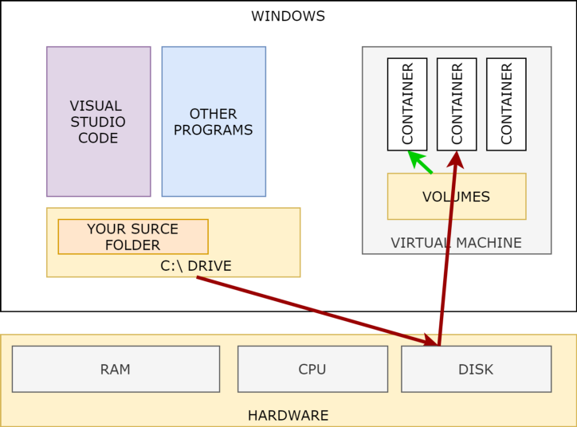

---
title: "도커와 윈도우"
description: "윈도우에서 도커를 사용하는 방법에 관한 내용입니다."
date: 2022-02-20T16:54:39+09:00
categories: ["도커", "윈도우"]
tags: ["docker_desktop", "hyper-v", "virtaul_box", "virtual_machine", "vscode" ,"wsl2"]
image: "thum.png"
draft: false
---

## 윈도우

### 윈도우에서의 도커

도커의 기본 환경은 리눅스에 맞춰져 있습니다. 따라서 윈도우에서 도커를 사용하려면 다른 방법을 선택할 필요가 있으며  
각 방법은 장단점이 존재했습니다.  대부분 가상머신을 이용한 방법입니다.

### 가상 머신

가상머신은 기존의 운영체제(Host OS)에 가상의 운영체제(Guest OS)를 올릴 수 있게 해주는 소프트웨어 입니다.  
도커도 가상머신과 흡사하지만 GuestOS를 모두 올리는 것이 아니라. 필요한 쉘과 커널등만 올린다는 차이점이 있습니다.  
즉 도커는 가상머신 만큼 자유롭지는 못하나. 환경을 만들고 사용하는 부분에서 가볍게 진행 가능합니다.

정리해보면 윈도우에서 우분투 컨테이너를 사용하려면  
**윈도우 -> 가상머신 -> 리눅스 -> 도커 -> 컨테이너**  
의 관계를 거쳐야 합니다. 그렇게 깔끔하진 않은 것 같습니다.

## 윈도우에서 사용하는 방법들

### Docker Toolbox

[공식 Github](https://github.com/docker-archive/toolbox/releases)

과거에는 Docker Toolbox를 주로 사용했습니다.  이것은 Virtualbox로 도커를 쉽게 설치/연결 시켜주는 가상머신 파일입니다.  
그 시절 때 상대적으로 가벼웠던 Virtualbox는 도커를 쓰기 위해 잠깐 사용 할 가상머신으로 적합했습니다.  
그러나 가상머신 특징상 HostOS와 GuestOS가 분리되어 IDE로 Remote하지 않는 이상 환경 공유에 불편함이 따랐습니다.

결국은 이후에 더 편리한 방법이 나와 2019년에 프로젝트가 중단되었습니다.

### WLS2

WLS2는 Windows에서 제공하는 리눅스용 하위 프로그램입니다. 쉽게 말하면 오직 리눅스 계열을 구동시킬 수 있는 가상머신입니다.  
기존의 WLS1은 가상머신과 거리가 멀되 HostOS인 윈도우와 호환성이 높게 만들어졌었으나  
Hyper-V를 사용하는 WSL2로 만들면서 WLS1보다 가상 환경의 성능을 더 우선시하게 만들어 졌습니다.

비록 WLS1보다는 문제가 있지만 HostOS와 환경 공유도 가능하고 GuestOS의 성능도 뛰어나 출시 후 각광 받았습니다.  
이 곳에다 Docker를 설치하여 컨테이너가 필요한 순간마다 WSL2를 사용하면 됩니다.

### Docker Desktop

위에서 나오는 모든 방법들은 컨테이너를 사용하기 위해 가상 머신을 사용해야 한다는 공통점을 가지고 있습니다. 이것은 번거로운 일입니다.

Docker Desktop은 이와 다르게, 설치되어있는 WSL2을 이용하여 HostOS에서 Docker를 사용할 수 있도록 도와줍니다.  
그렇기 때문에 사용하기 위해선 Hyper-V과 WSL2가 설치되어 있어야 합니다.

예전에는 ARM 아키텍처를 이용하는 맥OS 계열에서도 이것을 사용했으나  
최근 Docker는 ARM아키텍처를 지원하게 되었기 때문에 해당 선택지를 고를 필요는 없습니다.

이것은 편리하지만 심각한 메모리의 사용률과 상업적 이용의 유료화 때문에 상위호환의 선택지가 될 수 없습니다.
