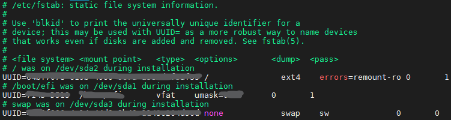

## Partion

### 설명

기본적으로 리눅스의 Filesystem은 다음과 같은 과정을 통해 만들어집니다. Partion > Format > Mount 의 과정을 거칩니다.  
윈도우는 자동 마운트됩니다.  

기본적으로 Partion은 하나의 보조기억장치를 여러 개의 Filesystem으로 만들고 싶을 때 사용합니다. 분할해서 사용하지  
않는다고 해도 칸 하나를 사용하겠다는 명시가 필요합니다.

추가로 리눅스에서는 여러개의 저장 장치를 하나로 합치는 LVM이라는 개념이 존재합니다. Partion의 반대 개념에 가까우며  
최근에 윈도우에도 비슷한 기능이 추가되었습니다.

### 명령어

```bash
fdisk -l
```

로 정확한 장치를 찾아서

```bash
fdisk /dev/[장치명]
```

으로 파티션 모드에 진입할 수 있습니다. 명령어로 진행되는 것이 아니라,  마법사형식을 이용합니다.  
n, p 등을 누르면서 안내하는 내용을 따르면 문제 없습니다.

윈도우와 다르게 고려되어야 할 사항은 주영역, 가상영역, 그리고 Swap입니다. 이것은 가상메모리의 역할을 합니다.


## Format

### 설명

저장공간의 Format은 선택한 공간에 FileSystem을 구성시키는 것을 뜻합니다. 이 단어가 주로 초기화 작업을 뜻하는 이유는  
FileSystem은 하나의 공간에 하나만 사용될 수 있으며 새롭게 FileSystem 을 구성시킬때 본래있던  
저장장치의 파일을 가르키는 맵핑, 테이블 정보가 덮어씌워지면서 사실상 정보가 삭제된 것처럼 되기 때문입니다. 

리눅스에서 자주 사용되는 FileSystem은Ext4, XFS등이 있습니다. 자세한 내용은 다음에 다루겠습니다.

### 명령어

혹시 쓰던 저장장치를 포맷할 계획이라면 당연히 unmount된 상태여야 합니다.

```bash
mkfs.[파일 시스템 타입] /dev/[장치]
```

마찬가지로 마법사 형식입니다. y를 누르며 진행할 수 있습니다.


## Mount

### 설명

mount는 특정 저장장치를 디렉토리와 연결하는 행위입니다. 윈도우는 알아서 해주거나, 파일 관리자를 거쳐 해결할 수 있으며  
요즘 우분투 사용자 편의를 위해 알아서 데스크탑에 mount 하게 됩니다.  

물론 mount를 하여 제대로 쓰기 위해선 fdisk와 같은 명령어로 포멧, 파일시스템 구축이 완료된 상태여야 합니다.

### Mount 상태 확인

```bash
findmnt
```

*fdisk -l 또는 mount -l* 도 있지만 해당 경우에는 위의 명령어가 훨씬 보기 편리했습니다.

### Mount 하기

```bash
mount /dev/<장치명> <마운트 포인트>
```

취소는

```bash
umount /dev/<장치명>
```

하지만 위의 명령어는 일시적이며 reboot 후 필요하다면 다시 입력해야 합니다.

### fstab-파일시스템 테이블

부팅 시 자동으로 mount가 되기 위해선 해당 파일을 수정해야 합니다.

```bash
nano /etc/fstab
```



기본적인 mount 는 하단에 *<장치명> <마운트 포인트> <파일 시스템 종류> <옵션>* 을 추가하면
reboot 후부터 적용됩니다.

주의해야 할 사항이 있는데  
만약 현재 ssh등의 방법으로 remote중에 이것을 변경했다면 **반드시 오탈자가 없는지 확인해야 합니다.**  

만약 오타가 존재한다면 리눅스가 reboot 중에 SSH server를 포함한 프로세스를 실행하기 전 오류로 중단되므로 담당자가 remote를  
하지 못하고 직접 가서 local상으로 부팅 설정을 해야 하는 상황이 발생합니다.

