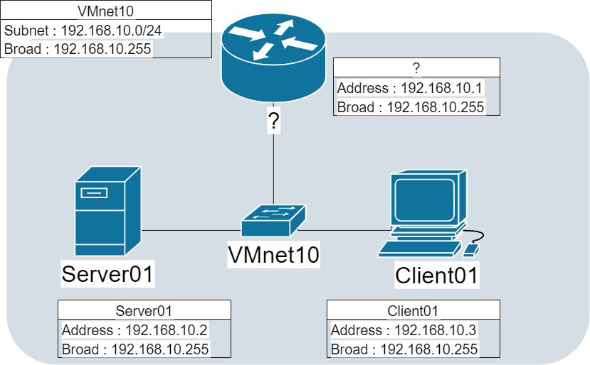
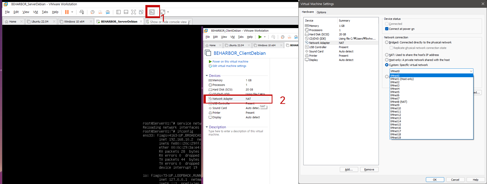
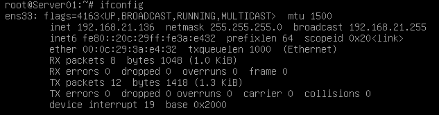
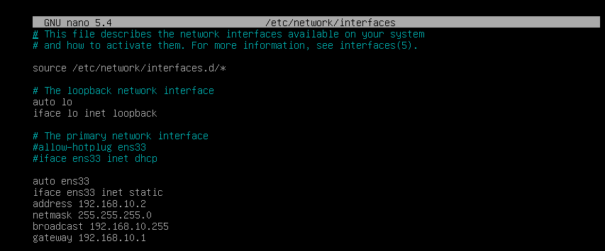
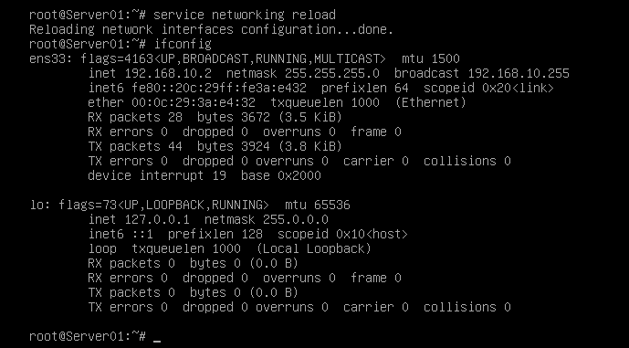
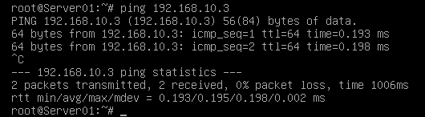

## 서론

GuestOS에서 무언가를 설치하기 위해 인터넷과 연결하여 사용할 때가 있을 것이며  
인터넷이 아닌 공부 목적의, 내부 네트워크의 환경을 사용하는 일도 있을 것입니다. 이 두가지를 쉽게 오가면서 사용할 수 있도록  
미리 준비 해놓으면 굉장히 편리합니다.

우리의 목표는 아래의 토폴로지와 같은 매우 간단한 형태의 네트워크망입니다.



## VMNet

### 설명

VMNet은 VMWare Workstation에서 지원하는 가상 인터페이스, 네트워크입니다. 이것을 통하여 내부 네트워크망을 구현할 수 있습니다.  
네트워크 환경은 Subneting, Gateway 그리고 구축하지 않아도 제공되는 DHCP 서비스등을 설정할 수 있으며
인터페이스는 위의 네트워크 환경이 아니더라도 NAT, Bridge 등을 지원합니다.   

이번 시간에 필요한 환경은 하나의 내부 네트워크가 필요합니다. VMNet은 하나를 추가로 만들 것입니다.

### Virtual Network Editor 설정

Edit→Virtual Network Editor 으로 들어갑니다. 그 후에 아래의 Change Settings까지 눌러주셔야 합니다.

| 적용된 설정 | 설명 |
| --- | --- |
| Host-only | 브릿지, 나트가 아닌 오직 VM 내부에서만 동작하게 되는 망입니다. |
| Connect a host vitual adapter~ | 체크를 하게되면 HostOS 설정(ex 윈도우 제어판)에도 해당 어뎁터가 감지됩니다. |
| Use local DHCP~ | VMWare에서 지원하는 DHCP를 적용시킬 수 있습니다. |

우리는 Add Network로 Vmnet10 을 추가하면 됩니다. 설정하면 다음과 같습니다.


## Linux(Debian계열)

### 설명

인터넷망과 내부망의 연결을 오갈수 있다고 끝난 이야기가 아닙니다. 그때 마다 올바른 아이피주소를 사용해야 할 것입니다.  
기존은 DHCP로 되어있을 것이니 Static설정을 추가하고 경우에 따라 주석처리, 주석해제를 반복하며 사용하면 편리합니다.

### 설정

위쪽(1)의 버튼을 눌러 잠깐 GuestOS에서 빠져나올 수 있습니다. 그 다음(2)을 누르면 바로 인터페이스 설정에 들어갈 수 있습니다.



이곳에서 앞에서 설정했던 VMNet을 선택해주겠습니다. 만약 GuestOS가 실제 Host였다면 인터페이스에서 나온 선이 인터넷이  
아닌  내부망의 허브에 물린 셈입니다.

다시 Debian으로 복귀해 본격적인 설정하기 앞서 ifconfig으로 인터페이스 이름을 확인해 보겠습니다. 당연히 명령어를 사용하실 때는 권한에 유의하셔야 합니다.

```bash
ifconfig
```



저같은 경우는 **ens33**입니다. 사진처럼 외부 아이피주소가 할당된 인터페이스를 찾으면 됩니다.

이제 이름을 기억하고 아래처럼 인터페이스 설정파일에 접근하겠습니다.

```bash
nano /etc/network/interfaces
```

여기서 부터는 오타에 주의해야합니다. 오타가 발생하면 인터페이스 갱신이 불가능 해지며 이것은 연결이 불가능함을 뜻합니다.

여기서는 각 인터페이스의 address, subnet, netmask, broadcast, gateway 등을 설정할 수 있습니다.

기존의 DHCP 설정은 주석처리하고 아래와 같이 적어보겠습니다.



이후엔 오타를 다시 확인해보고 갱신 명령을 실행시키면 완료됩니다. 설정이 제대로 변경되었는지 확인해봅시다.

```bash
service networking reload
ifconfig
```




## Windows

### 설명

Windows는 Linux보다 더 편리하게 설정할 수 있습니다. 먼저 위와 동일하게 해당 GuestOS의 인터페이스 VMNet은 변경해야 합니다.  
위의 토폴로지처럼 마찬가지로, 동일한 VMNet과 연결하면 되겠습니다. 또한 윈도우에서 아이피 주소를 변경하는 방법은 자세히  
나와있으니 쉽게 하실수 있습니다만 윈도우 방화벽 정책에 ICMP와 같은 여러 프로토콜이 막혀있기 때문에 **방화벽을 설정하거나 해제해야 합니다.**

## 마무리

서로 ping명령어를 사용하여 연결이 제대로 되어있는지 확인할 수 있습니다.

