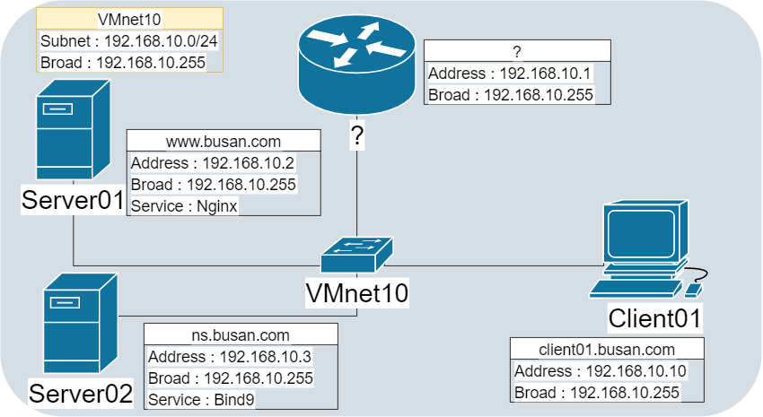
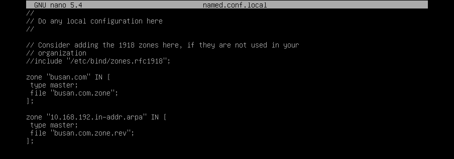
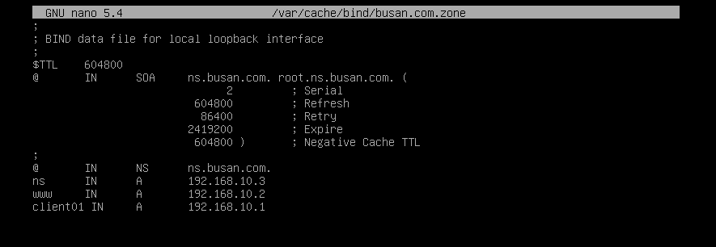
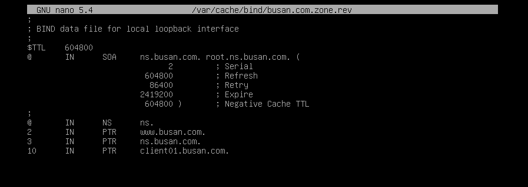
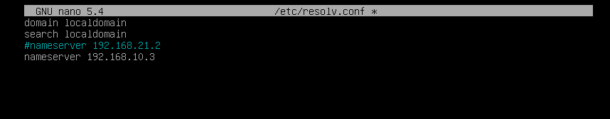
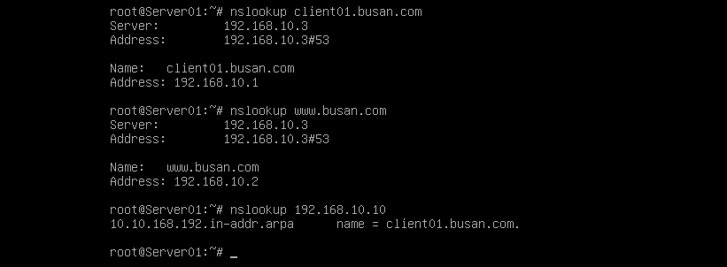
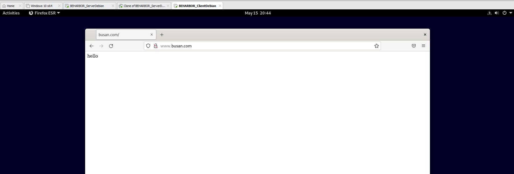

## 서론

앞에서 IP Address로 신호를 보내봤지만, Domain name형식이 아닌 주소를 쓰는 경우는 매우 보기 어렵습니다.  
대부분의 학생분들은 DNS라는 단어를 들어보셨을 거라 생각합니다. IP Address와 Domain name간의 맵핑을 이루게 해주는 서비스, 내지 서버입니다.  
실은 여기 Domain이란 단어는 우리가 알고있는 문자 형식의 주소를 뜻하는 말보다 더 여러가지의 내용이 포괄된 단어입니다. 이 내용과 관련해서는 다음에 다루어보도록 하겠습니다.

## Bind9

### 설명

우리의 목표는 아래의 토폴로지입니다. 이 블로그 페이지는 Server2에 있는, DNS를 만들어주는 Bind9의 설정법을 다루어 볼 것입니다. 그 밖의 설정들은 되어있다고 가정하겠습니다.



DNS은 Domain name을 IP Address로 변환해주는 정방향, 그 반대인 역방향이라는 개념과 주, 보조영역의 개념이 존재합니다. 오늘은 주 영역으로 정, 역방향을 구성해보도록 하겠습니다.

### 구현

설치하고 zone 설정을 시행합니다.

```bash
apt-get install bind9
cd /etc/bind9
nano named.conf.local
```

아래처럼 작성해 보겠습니다. 위에는 정방향, 아래는 역방향입니다.



이제 정의해준 파일을 만들어 주어야 합니다. 포함된 예제가 있으니 그것을 복사해서 사용하겠습니다.

```bash
cp db.empty /var/cache/bind/busan.com.zone
nano /var/cache/bind/busan.com.zone
```



SOA로 시작하는 내용은 DNS의 갱신, 캐시, 재요청등의 설정들을 뜻하며  
그 이후부터는 맨 왼쪽의 문자로 접근했을 때 내보낼 결과를 뜻합니다. 단 @는 [busan.com](http://busan.com) 자체가 요청 됐을때의 경우입니다.  
이제 역방향 파일을 만들어주겠습니다.

```bash
cp /var/cache/bind/busan.com.zone /var/cache/bind/busan.com.zone.rev
nano /var/cache/bind/busan.com.zone.rev
```



IN 이 PTR로 바뀌었다는 것 말고는 뜻이 동일합니다.

마무리 하셨다면

```bash
named-checkconf
```

로 신택스 테스트를 할 수 있습니다. 아무 출력도 없으면 통과 된 것입니다.

```bash
service bind9 restart
```

로 bind9설정을 적용시킬 수 있습니다.

### 외부 설정

이제 Server01,02 그리고 Client01 각각 DNS 위치가 Server02라는 것을 설정해야합니다.

이 또한 나중에 인터넷 연결이 필요할 때 다시 원상태로 복구해야하는 점을 고려하여 원래 있던 내용을 **주석처리** 하시길 바랍니다.

윈도우는 쉬우니 넘어가고 Debian만 살펴보겠습니다.

```bash
nano /etc/resolv.conf
```



이렇게 설정하시면 완료됩니다. 참고로 리눅스에서는 DNS주소 설정이 resolv뿐만 있는것이 아닙니다.

## 테스트

먼저 Server01로 가보겠습니다.

```bash
nslookup client01.busan.com
nslookup www.busan.com
nslookup 192.168.10.10
```



정상적으로 나오는 모습을 확인할 수 있습니다.  
client01의 브라우저로 http://www.busan.com 에 접속해 보겠습니다.



역시 잘 되는 모습을 확인할 수 있습니다.
