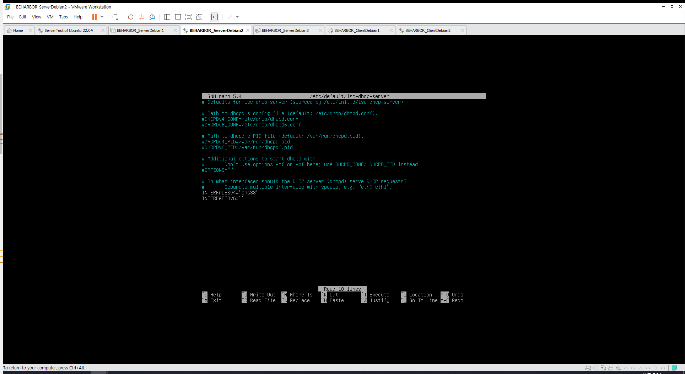

## 서론

### 개요

DHCP를 리눅스에서 구성하는 것은 어렵지 않습니다. 두개 정도되는 설정파일을 수정하는 것 만으로 구성할 수 있습니다.  
문제는 DNS입니다. 만약 클라이언트 측의 IP Address가 동적으로 변한다면 DNS도 이에 따라 변해야 할 것입니다.  

이렇게 정보가 바뀔 때 마다 DNS에 자동으로 갱신 시킬 수 있는 서비스를 DynamicDNS라고 부릅니다.

이번 작업을 하기전에 앞의 작업이 정말 이상이 없었는지 확인해 보시는걸 추천드립니다.  
당연히 이런건 말을 하지 않아도 앞으로 해주는 것이 좋습니다. 또한 이 과정에 없더라도 어떤 단순 명령이 동작하지 않으면  
앞의 과정을 기반으로 충분히 해내실 수 있어 적지 않은 것이니 찾아보시길 권장드립니다.  
*(ex>Server02에서 ping client01.busan.com이 안되는데?)*

### 토폴로지


## 준비작업

### 클라이언트 추가

먼저 클라이언트를 하나 더 추가해 놓겠습니다. 기존에 있는 클라이언트를 clone 하셔서 만들어 주시면 됩니다.  
단 hostname 기준으로 만들어 놓을 것이기 때문에 두 클라이언트의 hostname은 달라야 합니다.

hostname은 /etc/hostname 수정 후 재부팅으로 변경할 수 있습니다.


### BIND9 정적 정보 삭제

이번 구현을 완료하면 [hostname].busan.com 과 같이 호스트네임과 변경되는 IP Address에 따라 자동으로 정보가 생성될 것입니다.  
따라서 앞에서 만들어 놓은 client01 부분은 모두 삭제하겠습니다.


### 필요 패키지 설치

```bash
apt-get update
apt-get install isc-dhcp-server bind9-utils
```

먼저 앞으로 필요한 데몬을 설치하겠습니다. 해당 데몬들은 이름에서 유추할 수 있는 기능 그대로를 제공합니다.

## BIND9 설정

### 개요

BIND9는 DHCP보다 설정할 것이 적습니다.
해당 과정은 앞으로의 BIND9 설정에도 유용하게 쓰일 개념들이 많으니 참고해서 진행하시면 좋겠습니다.

### 설명

이 곳을 수정합니다. 도메인의 상세 설정을 하는 곳입니다.

```Bash
nano /etc/bind/named.conf.local
```

아래 내용을 추가합니다.

```Bash
include "/etc/bind/rndc.key";
controls {
  inet 192.168.10.3 allow { 192.168.10.3; } keys { rndc-key; };
};
```

**rndc.key**라는 단어가 나왔습니다. 해당 암호화키는 DHCP와 BIND9가 서로 약속된 사이가 맞다는 것을 증명합니다.  
만약 없거나, 새로운 rndc.key를 발급하고 싶다면  *rndc-confgen*를 사용하여 생성할 수 있습니다.

이번에는 BIND9를 설치하면서 자동으로 생긴 키를 사용하겠습니다.  
다음으로 해당 IP Address의 서비스를 해당 IP Address가 수정하는 것을 허락하겠다는 내용입니다.  
즉 동일한 곳에 설치된 DHCP 서비스가 BIND9와 상호작용 할 수 있다는 것을 서술합니다.

다음으로 앞에서 정의해 둔 도메인 정방향, 역방향 영역에 allow-update { key rndc-key; }; 를 추가합니다.  
해당 키를 이용한 갱신을 허락하겠다는 내용입니다. 마쳤으면 아래와 같이 나타납니다.


확인이 완료되었으면 BIND9를 재시작 합니다.

```Bash
service bind9 restart
```

## DHCP

### 개요

DHCP는 서브넷팅 관련 지식이 있다면 추가적으로 설명할 내용은 없습니다.  
이번 포스팅에서는 갱신 시간과 같은 상세 설명은 넘어가도록 하겠습니다.

### 설명

먼저 전파점 인터페이스를 설정합니다. 인터페이스 이름이 기억이 안난다면 ifconfig으로 확인할 수 있습니다.  

```bash
nano /etc/default/isc-dhcp-server 
```



다음은 본격적인 설정입니다. 길게 수정할 예정이기 때문에 원본 설정파일을 백업하고 파일을 그림처럼 작성합니다.  
주석을 풀면서 만드셔도 되고, 다 지운 뒤 새로 작성해도 상관 없습니다.

```bash
cd /etc/dhcp
cp dhcpd.conf dhcpd.conf.back
nano dhcpd.conf
```


중요한것만 집고 넘어가면  
**option**이 붙은 내용들은 DHCP서비스를 받는 호스트에게 해당 정보가 뿌려진다는 것을 뜻합니다.
그리고 **subnet 영역**이 우리가 기본적으로 알고있던 DHCP의 기능, 동적 주소 범위를 나타내는 것이며  
원한다면 이곳에 특정 MAC Address에는 고정주소가 발급되도록 만들 수 있습니다.

작성이 완료되었다면 dhcpd -t를 통해 문법 검사를 실시할 수 있습니다. 문제 없다면 재시작 하면 완료입니다.

```bash
dhcpd -t
service isc-dhcp-server restart
```

## 마치며

### 검사

먼저 각 클라이언트를 내부망에도 불구하고 static을 해제합니다.


재부팅 하면 제대로 동적할당 되고있음을 확인할 수 있습니다. 또한 nslookup으로 클라이언트의 아이피주소를 입력하면  
알아서 클라이언트의 호스트 이름으로 자식 도메인네임을 만든 것을 확인할 수 있습니다.


### 추가 개념

이번 작업을 해보시면서 이해가 잘 되셨다면 의문점이 들 수 있습니다.  
DHCP도 서버의 일종입니다. 당연히 그럼 통신이 이루어져야 하고 이것은 같은 범위의 네트워크여야 가능합니다.

그렇다면 다른 범위에서 DHCP를 얻어오는것이 어떻게 이루어지는지 궁금할 수 있습니다. 이것을 가능하게 하는 기능을  
**DHCP Relay** 라고 합니다.

이런 의문도 있습니다. 우리는 BIND9를 통해 DNS를 구성했습니다.  
실제 인터넷 모든 전역의 도메인 네임은 굉장히 많습니다. 이것을 전부 한 곳에 몰아서 기록 시킨 것인지 궁금합니다.  
실은 그렇지 않습니다. DNS 자체가 굉장히 많으며 DNS 끼리 정보를 교환합니다. 이것을 **DNS Fowarding** 이라고 합니다.

이 두가지 기능에 대해선 다음 포스팅에서 만나보도록 하겠습니다.
