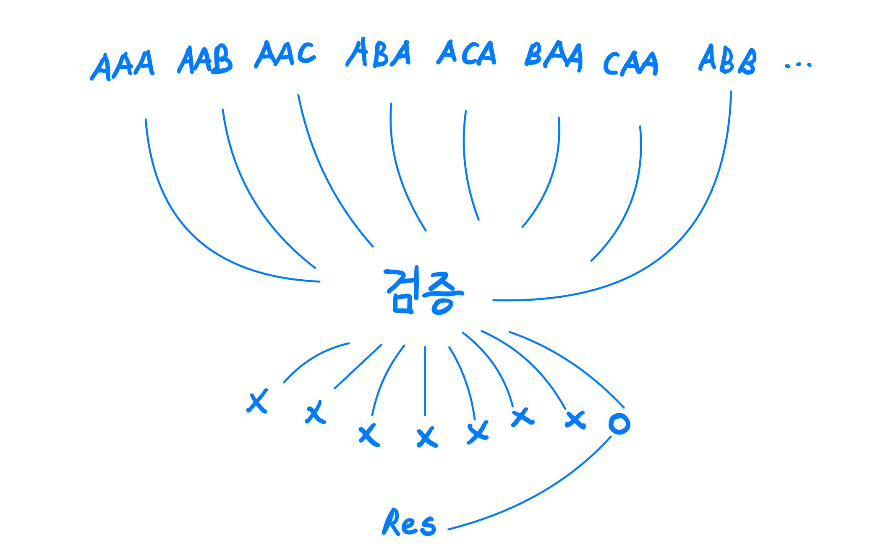
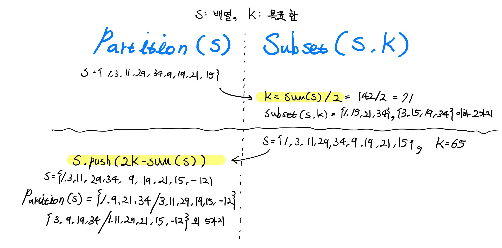

## 서론

### 컴퓨터 '과학'

저만 그렇게 생각했었는지 모르겠으나 컴퓨터 과학이라는 단어가 어렵게 느껴졌습니다.

과학을 잘 다루는 *공학*은 컴퓨터와 매우 어울리는 단어일 것입니다. 알고리즘이 컴퓨터 공학중 하나라고 말해도 저는 어색함을 느끼지 못할 것 같습니다.
하지만 알고리즘은 컴퓨터 과학, 컴퓨터 수학이라는 단어를 자주 사용합니다. 왜 그런지 여러분들은 아시나요?

### 개요

P-NP 문제는 컴퓨터를 전공하지 않는 분들이라도 한번쯤은 들어봤을지도 모르는 문제라고 생각합니다. 해당 문제는 딱히 전문지식이 없어도  충분히 이해하실 수 있습니다. 이번에는 해당 난제를 이해하기 위한 개념들과, 최종적으로 해당 문제를 알아보도록 하겠습니다. 

## 부분개념 해설

### 다차(다항식) 알고리즘

전공생들이면 다들 알다시피 알고리즘은 여러 복잡도 표기법을 통하여 나타낼 수 있으며 가장 많이 쓰는 것은 *빅 오* 입니다.  
최악의 경우를 고려하는 것은 어쩌면 알고리즘에 당연한 것이 아닌가 싶습니다.

다차 알고리즘은 O ( p(n) ) 일 때 p(n)이 다차 함수인 경우입니다. 예를 들어 O ( 2^n ) 은 다차함수가 아닙니다.  
이 개념을 요약하여 다차시간에 풀 수 있다. 없다. 로 부르기도 합니다.

### Instractable (아주 다루기 힘든) 문제

다차 알고리즘을 찾을 수 없는 문제를 뜻합니다. 풀어서 설명하면  
다차로 풀리지 않는 경우가 하나라도 있거나 풀 수 없다고 증명된 문제를 뜻하며, 더 풀어서 설명하면 쉬운 방법으로 풀 수 없는 문제를 뜻합니다.

### Instractable 로 증명된 문제

현실에 존재하는 알고리즘 문제는 Instractable 개념을 사용하여 3가지로 나누어 볼 수 있습니다.

 1. 다차시간 알고리즘이 존재하는 문제 *[ ex : 정렬 O(n lg n), 정렬된 배열 검색 O(lg n), 행렬곱셈 O(n^2.38) ]*
 2. Instractable 이 증명된, 어려운 방법으로만 풀 수 있는 문제 *[ ex : 모든 해밀토리안 회로 결정하기 O((n-1)!)) , 종료문제(불가능) ]*
 3. 다차시간 알고리즘을 찾지 못했으나 Instractable이 증명되지 않은 문제 *[ ex :  0-1 배낭 채우기, 외판원, M-색칠, 해밀토리안 회로]*

모든 알고리즘 문제에서 2번은 아주 적은 비율을, 3번은 가장 많은 비율을 차지합니다. 이번 난제에서는 3번에 초점이 잡혀 있습니다.  
딱 봐도 3번의 경우가 가장 골치아플 것입니다.

### 결정 문제, 최적화 문제란?

위와 잠깐 다른 방법으로 다시 알고리즘 문제를 나누어 볼 것입니다. 이것은 쉬운 개념입니다.

결정 문제는 다음과 같습니다. 제 손에 학생들의 키가 작성되어 있는 자료가 있습니다. 그러곤 문제가 나왔습니다. 가장 키가 큰 학생은 구본현인가?  
이것의 정답은 참 아니면 거짓일 것입니다.

최적화 문제로 예를들어보면 다음 문제가 있습니다. 학생들 중에 키가 가장 큰 학생이 누구인가?  
또는 키가 1, 2, 3등으로 큰 학생들을 나열하라

어떤 차이가 있는지 아시겠나요? 최적화 문제의 예로는 외판원 문제, 0-1 배낭 채우기 문제등이 있습니다.  
참고로 이 두 문제는 최소값, 최대값 원하는게 서로 다릅니다. 하지만 이것은 상관 없습니다.

### 결정 문제, 최적화 문제의 관계

핵심 관계는 이렇습니다. 어떤 문제가 최적화 문제이고 다차 알고리즘이 존재한다면 이 문제의 결정문제 알고리즘도 반드시 다차 알고리즘이 존재합니다.

예를 들어 학생 키의 1, 2, 3등을 정의할 수 있고 이것이 빠른 속도로 풀린다면, 가장 키가 큰 학생이 구본현인지 알아내는 것도 빠르다는 것입니다.  
이것은 당연한 말이기도 합니다. 만약 모든 문제가 마찬가지인지 의심이 되신다면, 위의 관계는 이미 식으로 증명이 되어있습니다.

조금 더 생각하고 지나가면, 최적화 문제에서 결정 문제로 넘어가는 것은 위의 예제처럼 쉬울 것입니다.  
하지만 거꾸로 결정 문제에서 최적화 문제로 넘어가는것은 쉽지 않습니다. a가 가장 키가 큰가? b가 가장 키가 큰가? 라는 방법으로  
모든 학생들의 키를 점검하는 방법론인데 해당 결정문제가 약간이라도 복잡한 형태라면 느릴 것입니다.

이를 제대로 이해하셨다면 *"왜 당연한 말을 길게하지?"* 라고 생각하실 수 있다고 생각합니다.

### 비결정적 알고리즘

좋습니다. 이것 또한 복잡한 개념은 아니라고 생각합니다. 복잡하기보다 우리가 알고있는 알고리즘과 달리 이상한? 말이 될 것입니다.  
책에 나올듯한 딱딱한 설명으로는 다음과 같습니다.  
추측 단계에서 비 결정적으로 답을 추측하고, 그 답을 결정적인 검증을 통하여 옳바른 답을 찾는 알고리즘.

이것을 이해할 때는 위에서 말한 결정문제에서 최적화 문제로 가는 예를 생각하면서 보시면 편리할 것입니다.

가방 채우기 문제를 예로 들어보겠습니다. 여러분은 여러 물건이 있고 각 물건은 무게와 값어치라는 속성이 있습니다.  
가방에 최대로 넣을 수 있는 무게는 정해져 있습니다. 여러분은 최대한 값어치 있게 가방에 넣는것이 목표입니다.

이것은 아주 유명한 문제입니다. Branch and Bound 알고리즘등으로 해결할 수 있습니다. 하지만 비결정적 알고리즘으로 풀어볼까요?  
먼저 랜덤으로 물건을 선택합니다.. 그리고 물건의 무게가 정해진 무게보다 높으면 처음으로 되돌아 갑니다.  
만약 선택한 물건이 정해진 무게보다 이하라면 물어봅니다. 이것이 최대의 값어치인가요? 이 물음이 참이면 답으로 결정됩니다.  

이와같이 각 분기를 모두 꺼내보고 검증을 통하여 답의 참, 거짓을 판단하는 알고리즘을 비결정적 알고리즘이라고 명칭합니다.  
이때 중요한 것이, **검증은 해당 결정문제의 다차시간 알고리즘의 존재 유무 관련 없이 다차시간 알고리즘이 존재할 수 있습니다.**

## P-NP 문제

### P와 NP

드디어 주제입니다. 위에 알아본 개념을 사용해서 정의를 살펴보겠습니다.  
먼저 **NP는 다차시간 비 결정적 알고리즘으로 풀 수 있는 결정 문제**입니다.  
처음 접하시는 분들도 이해할 수 있도록 풀어서 알아보면, 그 어떠한 방법을 써서든, 느리든 말든 다차 알고리즘으로 풀 수 있는 결정문제 입니다.

**P는 다차시간 알고리즘이 존재하는 결정문제**입니다. 마찬가지로 풀어서 이해해보면 우리가 이해할 수 있는 쉬운 방법으로 풀 수 있는 결정문제입니다.

햇갈리신다면 위의 글을 참고하여 검증이 빠른것과 문제가 빠른것이 다른 이야기라는 것을 참고하시면 좋겠습니다.

P에 속하는 문제는 NP일 것이며, NP에 조차 속하지 않는 것이 Instractable 문제입니다.

### 다항식 시간내로 문제 변환가능

기호로는 a ∝ b라고 표시합니다.  
뜻은 문제 b가 다차 시간에 풀리며, 문제 a에서 문제 b로 다차시간내 변환이 가능하다면 문제 b도 다차시간 내로 풀 수 있습니다.

이것도 식으로 증명된 것입니다. 하지만 문제 변환이 무엇인지 짚고 넘어가 볼까요? 예로 두 문제를 꺼내보겠습니다.

 - Partition 문제 : 집합 하나를 겹치는 원소가 없이 합이 같게 두 배열로 쪼개라
 - Subset 문제 : 집합 안에 합이 n이 나오는 부분집합이 존재하는가?

각각 최적화 문제, 결정 문제라는 것을 이해 하셨을 것이라 생각합니다. 서로 문제간 아래와 같이 변환 가능합니다.

보면 변환하는 식도 다차방정식입니다. 즉 증명에 따라 Partition문제의 복잡도를 알 수 없어도 Subset문제가 다차시간으로 풀리기 때문에  
Partition 문제 해법도 다차 알고리즘 입니다.

### NP 완전

P-NP 문제가 흥미로운 이유입니다. 만약 어떤 결정문제 A가 NP이고 모든 NP 문제들이 A로 변환이 가능할 때 이 문제 A를 **NP난해**라고 명칭합니다.  
또한 NP난해이면서 NP인 문제들을 **NP완전**이라고 부릅니다.

NP완전인 문제는 굉장히 많습니다. 앞에서 나온 SAT, Circuit, 0-1 배낭채우기, Partition, Graphe Caloring, Subset Sum 들도 다 NP완전 문제입니다.  
즉 지금까지의 정리들을 사용하면 **세상 모든 NP문제들은 방금 예제와 동일한 난이도를 가지고 있습니다.**  
NP 완전의 정리는 복잡합니다. 관심이 있으시다면 *Cook Levin theorem*를 검색하시면 좋겠습니다.

## 그래서 P-NP가 뭔데?

### 정리

 - a∝b 일때 b가 P이면 a도 P이다.
 - 문제 c가 NP이고 문제 b가 NP-완전이고 b∝c이면 c도  NP-완전이다.

이것이 법칙이며 추가 내용으로는 NP 문제들이 모두 NP완전에 속하는 아주 간단한 문제와 같은 복잡도로 풀 수 있다는 것입니다.

이 P-NP 문제의 핵심은 이런 NP와 P의 관계에 초점이 잡혀있습니다. 아직 누구도 P와 NP의 연관관계를 찾지 못했습니다.
만약에 P=NP라고 가정해볼까요? 그럼 위에서 나온 NP완전의 개념을 똑같이 P완전으로 치환해서 읽어보면  
이 세상 모든 문제는 간단한, 다항식 시간으로 풀릴 수 있다가 됩니다.

**P-NP문제는 P=NP 이냐, P≠NP이냐를 증명하는 문제입니다.**

더 풀어서 말해보면, 세상의 *모든 문제가 쉬운 방법으로* 풀 수 있는지,  
그렇게 못하는 *어려운 문제라는 것이 존재*하는 것인지,  
아니면 이를 *증명하는 것이 불가능한지* 에 대한 난제입니다.

### 마치며

실은 PS문제를 풀어보신 분들이면 P=NP가 허무맹랑한 소리처럼 들리실 수 있습니다. 이렇게 고생을 해야 풀리는 문제들이  
실은 특정 복잡도를 넘지 않게 풀 수 있다니, 지금까지 석박사들이 고안한 훌륭한 알고리즘보다 더 빠른 알고리즘이 있다니?  
공상과학 영화에 나올 주제일지도 모르겠습니다.

아마도 문제는 이게 다를 것 같지만, 다르다는 증명이 성공하지 못했다는 것일거라 생각합니다.  지금도 많은 논문들이 해당 주제로  
제출이 되지만 그렇다한 성과가 없습니다.

이 글이 컴퓨터 학문, 공학적인 면모 이면을 보실 수 있는 계기가 되셨길 바랍니다. 고생하셨습니다.

