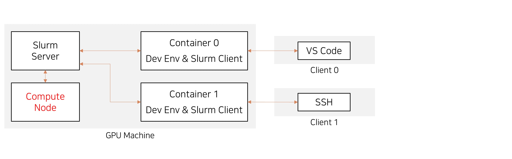

## 서론

### 개요

딥러닝 환경이 유행하기 전에 이미 예전부터 많은 사람들이 작업 스케줄러 혹은 클러스터 관리자를 사용하고 있었습니다.  
스케줄러는 하나 혹은 다수의 컴퓨터 속 CPU, RAM 자원을 여러 사용자가 요청해야 하는 환경에서  
순차적, 효율적으로 작업을 처리할 수 있게 도와줍니다.  
추가로 딥러닝 환경의 니즈가 늘어나면서, 지원하는 자원 중 GPU가 포함하게 되었습니다.

### 쿠브플로우와 차이

앞 포스팅에서 쿠버네티스, 쿠브플로우 설치에 대해 이야기 했습니다. 하지만 둘은 방향이 다릅니다.  
이 내용에 대해 잠깐 이야기 해보도록 하겠습니다.


쿠브플로우는 클러스터, 쿠버네티스로 만들어진 환경에 올라가는 서비스입니다.  
쿠버네티스는 하나의 Master nord와 다수의 Slave nore로 이루어져 있으며 사용자에게  
주피터 노트북, VSCode를 배포할 수 있습니다.

슬럼은 세 개의 서비스로 나누어져 있습니다. Server, Compute, Client 입니다.  
Server과 Client는 각각 호스팅과 그에게 전달을 도와주는 역할입니다.  
Server는 Client가 전달한 작업 명세서를 확인하고 어떤 Compute 에게 전달할 지 판단합니다.

쿠브플로우는 쿠버네티스라는 클러스터 환경에 올라가 파이썬 환경을 배포할 수 있는 편리한 솔루션이라고 하면  
슬럼은 좀 더 낮고 단순한 서비스로서 GPU를 포함한 자원을 돌아가면서 사용할 수 있게 해주는 솔루션이라고  
생각하면 좋을 것 같습니다.

### 컨테이너와 같이

개발환경을 나누는 법은 많습니다. 파이썬의 경우 아나콘다로 가상 환경을 만들 수 있으며,  
아니면 컨테이너를 활용하는 것이 일반적인 방법입니다.
이 방법을 응용하여 사용자에게 컨테이너만 전달한다면 보안적으로도 문제점을 해소할 수 있습니다.  

저는 슬럼을 컨테이너에 응용하기 위해 처음엔 아래와 같은 설계를 생각 했습니다.



컨테이너에 SSH와 Slurm Client를 설치한 후 베어메탈에 설치된 Slurm Server, Slurm Compute와 접촉하게  
만드는 것입니다.  
그리고 각 개발환경은 컨테이너 내에 있어서 환경 분리의 목적도 이루는 것입니다.

하지만 이 구조는 문제가 있습니다. Slurm의 작업(Job)은 명령어를 뜻합니다. 만약 파이썬 작업을 신청하는 것이 목적이라면  
명령어가 파이썬이 되는 것입니다.  
명령어는 Compute가 처리하게 됩니다. 즉 다시 말해 Compute에 모든 개발환경이 설치되어야 한다는 것입니다.  
그럼 어떻게 Slurm과 컨테이너를 같이 사용할 수 있을까요?

### docker run 을 명령어로

다르게 생각해서, 도커 이미지를 미리 만들어 놓고, run --rm 을 통째로 작업이라 전달 하기로 했습니다.  
즉 사용자가 환경을 사용하는 절차는 다음과 같습니다.

1. 사용자는 도커파일을 작성하고 이미지를 생성합니다.
2. 사용자는 run --rm (한번 이미지를 실행하고 종료되는) 명령을 Slurm에게 전달합니다.

문제를 방지하기 위해 권한 조정이 필요될 수 있습니다.


## 설치

설명되는 과정은 Ubunut 22.04 LTS 기준입니다. CUDA 관련 설치는 모두 완료되었다고 가정합니다.

### apt

```zsh
sudo apt update
sudo apt install slurm-wlm slurmd slurmctld
```

다음은 설정파일을 작성해야 합니다. Slurm은 특이하게도 기본 설정파일을 제공하지 않고  
웹 페이지에서 출력하도록 되어있습니다.  셀프 호스팅으로 웹 사이트를 열 수 있으나  
https://slurm.schedmd.com/configurator.easy.html 에서도 가능합니다.  
설정한 파일은 /etc/slurm/.conf 에 저장합니다

저는 아래와 같은 설정파일을 사용하겠습니다.

```zsh
sudo apt update
sudo apt install slurm-wlm slurmd slurmctld
```

도커, 도커 컴포즈를 설치합니다. 버전이 문제가 없다면 다른 방식으로 설치해도 무방할 것 같습니다.

다음은 slurm config을 설정합니다.

su--
```bash
cat > /etc/docker/daemon.json <<EOF
{
  "exec-opts": ["native.cgroupdriver=systemd"],
  "log-driver": "json-file",
  "log-opts": {
    "max-size": "100m"
  },
  "storage-driver": "overlay2",
  "storage-opts": [
    "overlay2.override_kernel_check=true"
  ]
}
EOF
```
suend--

```bash
sudo mkdir -p /etc/systemd/system/docker.service.d
sudo systemctl daemon-reload
sudo usermod -aG docker ${USER}
newgrp docker
sudo chmod 666 /var/run/docker.sock
sudo systemctl restart docker
sudo systemctl daemon-reload
sudo systemctl enable docker

curl -s https://packages.cloud.google.com/apt/doc/apt-key.gpg | sudo apt-key add
sudo apt-add-repository "deb http://apt.kubernetes.io/ kubernetes-xenial main"

sudo apt-get install -y kubelet=1.21.5-00 kubeadm=1.21.5-00 kubectl=1.21.5-00 --allow-downgrades --allow-change-held-packages
sudo apt-mark hold kubelet kubeadm kubectl
```
도커 권한 설정을 하고 쿠버네티스를 설치합니다.

su--
```bash
cat <<EOF > /etc/sysctl.d/k8s.conf
net.bridge.bridge-nf-call-ip6tables = 1
net.bridge.bridge-nf-call-iptables = 1
EOF
```
suend--

```bash
sudo sysctl --system
sudo systemctl daemon-reload
sudo systemctl restart kubelet
```

이 이후로는 해당 가상 머신을 Clone 1회 또는 2회하여 마스터 노드와 워커노드로 나눕니다.  
호스트 네임과 아이피 주소에 주의하세요, 호스트 네임같은 동일할 경우 문제가 발생합니다.


### 마스터 노드 설치-조인 전

```bash
sudo kubeadm init
mkdir -p $HOME/.kube
sudo cp -i /etc/kubernetes/admin.conf $HOME/.kube/config
sudo chown $(id -u):$(id -g) $HOME/.kube/config
kubectl taint nodes --all node-role.kubernetes.io/master-
kubectl create -f https://raw.githubusercontent.com/cilium/cilium/v1.6/install/kubernetes/quick-install.yaml
kubectl get pods -n kube-system --selector=k8s-app=cilium
```
쿠버네티스를 초기화합니다. 이후 출력되는 명령어를 이용하여 워커노드를 조인 시킵니다. (sudo)

### 마스터 노드 설치-조인 후

```bash
kubectl apply -f https://raw.githubusercontent.com/rancher/local-path-provisioner/master/deploy/local-path-storage.yaml
sudo apt install nfs-common
sudo apt install nfs-kernel-server
sudo mkdir /nfsroot
sudo chown nobody:nogroup /nfsroot
sudo chmod 777 /nfsroot
```

해당 과정은 NFS Client Provisioner를쿠버네티스가 사용할 수 있게 구축하고  
사용할 NFS Server도 마스터 노드에 올리는 과정을 설명하고 있습니다.

sudo nano /etc/exports 로 아래 내용 추가

```bash
/nfsroot 192.168.80.110(rw,insecure,sync,no_root_squash,no_subtree_check)
/nfsroot 192.168.80.111(rw,insecure,sync,no_root_squash,no_subtree_check)
```

해당 과정을 통하여, 존재하는 모든 노드에 NFS 공간을 할당하고 있습니다.  
쿠버플로우에서 NFS는 의무가 아니지만 없을경우 가변적으로, 쿠버플로우가 볼륨을 잡기 때문에  
비추천 하고 있습니다. 

```bash
sudo service nfs-kernel-server restart
sudo systemctl enable rpcbind
sudo systemctl enable nfs-server
sudo systemctl start rpcbind
sudo systemctl start nfs-server
sudo exportfs -a

curl https://raw.githubusercontent.com/helm/helm/release-2.16/scripts/get > get_helm.sh
chmod 700 get_helm.sh
./get_helm.sh
helm repo add raphael https://raphaelmonrouzeau.github.io/charts/repository/
helm repo update
helm install nfs-provisioner \
--set nfs.server=192.168.80.110 \
--set nfs.path=/nfsroot \
--set storageClass.defaultClass=true \
--set storageClass.name=nfs-provisioner \
raphael/nfs-server-provisioner

kubectl apply -f https://raw.githubusercontent.com/mojokb/handson-kubeflow/master/registry/kubeflow-registry-deploy.yaml
kubectl apply -f https://raw.githubusercontent.com/mojokb/handson-kubeflow/master/registry/kubeflow-registry-svc.yaml
```
**아이피 주소 192.168.80.110, 192.168.80.111은 각각 마스터, 워커의 주소입니다.** 환경에 맞춰서 사용해 주셔야 합니다.  
쿠버플로우의 경우 nfs를 사용하지 않을 시 가변용량 저장소를 이용하기 때문에 사양문제가 발생한다고 합니다.

### 마스터, 워커 공통 설치 진행

*/etc/docker/daemon.json*에 추가
```bash
"insecure-registries": [
    "kubeflow-registry.default.svc.cluster.local:30000"
  ]
```

그리고 재시작합니다.

```bash
sudo systemctl restart docker
```

*/etc/hosts*에 추가(이 부분은 미리 추가해도 됨)

```bash
192.168.80.110 kubeflow-registry.default.svc.cluster.local
```

### 워커노드에서 nfs 확인

```bash
curl kubeflow-registry.default.svc.cluster.local:30000/v2/_catalog
```

### 마스터 노드에서의 쿠버플로우 설치

```bash
wget https://github.com/kubernetes-sigs/kustomize/releases/download/v3.2.0/kustomize_3.2.0_linux_amd64
mv kustomize_3.2.0_linux_amd64 kustomize
chmod 777 kustomize
sudo mv kustomize /usr/local/bin

git clone https://github.com/kubeflow/manifests.git
cd manifests
while ! kustomize build example | kubectl apply -f -; do echo "Retrying to apply resources"; sleep 10; done
```

후에 
```bash
kubectl port-forward svc/istio-ingressgateway -n istio-system 8080:80
```
로 user@example.com/12341234을 사용하여 로컬상의 테스트가 가능합니다.  
또는 
```bash
kubectl port-forward --address 0.0.0.0 svc/istio-ingressgateway -n istio-system 8080:80
```
로 외부노출을 허용시킬 수 있습니다.

## 참고 자료들

만약에 정상작동하지 않을 경우 아래의 자료를 확인해주세요.

### 설치법

https://github.com/kubeflow/manifests  
https://learning-sarah.tistory.com/entry/Kubeflow-13-%EC%84%A4%EC%B9%98  
https://jwher.github.io/posts/install-kubeflow/  
https://lsjsj92.tistory.com/580  
https://yooloo.tistory.com/229  
https://velog.io/@ehddnr/kubernetes-kubeflow-%EC%84%A4%EC%B9%98-feat.-GCP  
https://losskatsu.github.io/it-infra/mlops01/#  
https://velog.io/@csk6124/Kubeflow-1.4-%EC%84%A4%EC%B9%98  
https://velog.io/@dev_halo/%EC%95%84%EB%AC%B4%EB%8F%84-%EC%95%88%EC%95%8C%EB%A0%A4%EC%A3%BC%EB%8A%94-on-premise-Kubeflow-%EA%B5%AC%EC%B6%95%ED%95%B4%EB%B3%B4%EC%9E%90

### 트러블 슈팅

https://hackmd.io/@maelvls/debug-cert-manager-webhook  
https://github.com/calebhailey/homelab/issues/3#issuecomment-569543391  
https://github.com/kubeflow/manifests/issues/2086  
https://mlops-for-all.github.io/docs/setup-components/install-components-kf/
